# Images Explanation

This document provides visual explanations and step-by-step screenshots for using the nsq-to-opensearch and OpenSearch dashboards. Each section corresponds to a specific image and describes what is shown.

**Prerequisite:** This guide assumes you have the nsq-to-opensearch stack running via Docker Compose.

## Table of Contents

- [img_01: Startup of nsq-to-opensearch](#img_01)
- [img_02: Startup of test service](#img_02)
- [img_03: Test service sending messages](#img_03)
- [img_04: nsq-to-opensearch processing messages](#img_04)
- [img_05: Access OpenSearch Dashboards](#img_05)
- [img_06: Set up Index Patterns](#img_06)
- [img_06_1: View created indexes](#img_06_1)
- [img_06_2: Refresh field list](#img_06_2)
- [img_07: Create Index Patterns](#img_07)
- [img_08: Finding the index](#img_08)
- [img_09: Define index pattern](#img_09)
- [img_10: Select timestamp field](#img_10)
- [img_11: Create index pattern](#img_11)
- [img_12: Index data fields and types](#img_12)
- [img_13: Discover menu](#img_13)
- [img_14: Select index pattern](#img_14)
- [img_15: Expand data](#img_15)
- [img_16: Index Management](#img_16)
- [img_16_1: Indexes data overview](#img_16_1)
- [img_16_2: Manage specific index](#img_16_2)

## img_01: Startup of nsq-to-opensearch
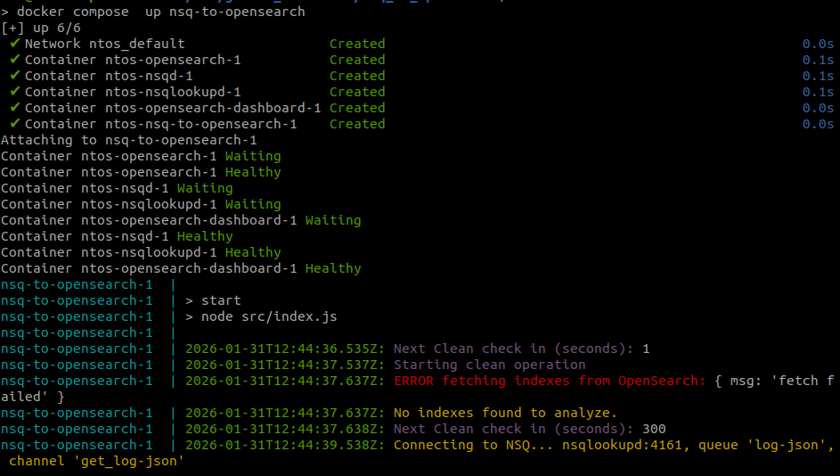
- Shows the startup of the 'nsq-to-opensearch' service.
- The "ERROR" messages are shown because there is no data yet (see the persistence directory).

## img_02: Startup of test service
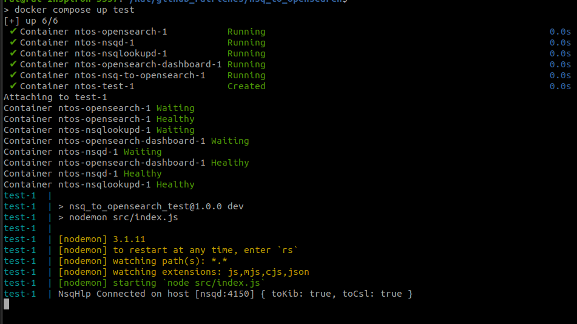
- Shows the startup of the 'test' service.

## img_03: Test service sending messages
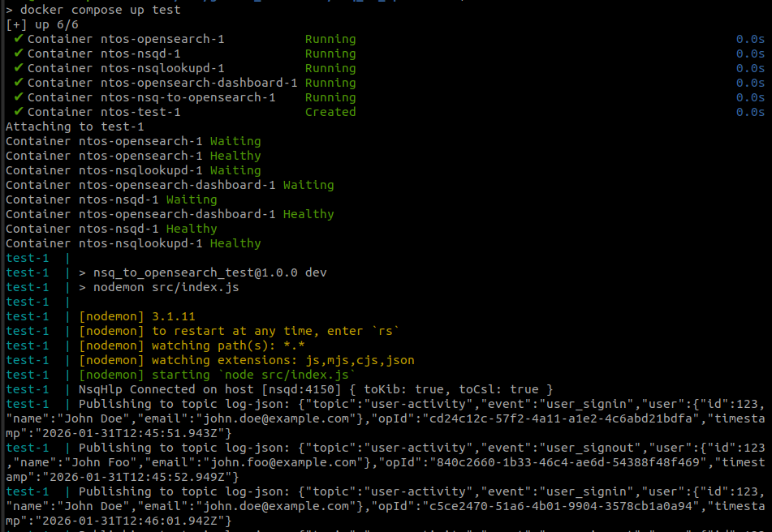
- Shows the 'test' service sending some messages.

## img_04: nsq-to-opensearch processing messages
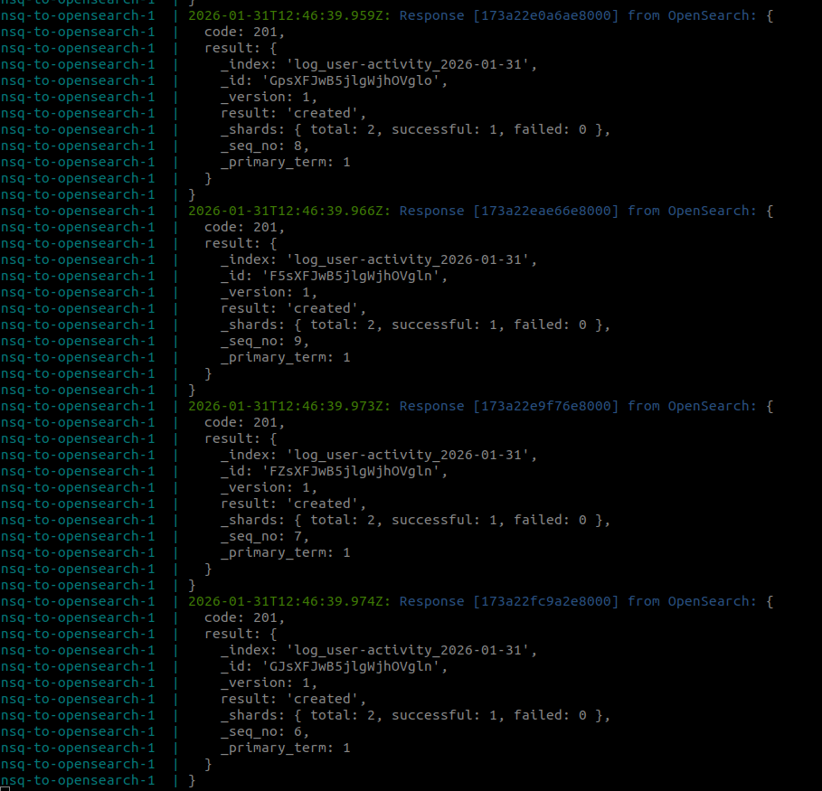
- Shows the 'nsq-to-opensearch' service processing messages (coming from the 'test' service).

## img_05: Access OpenSearch Dashboards
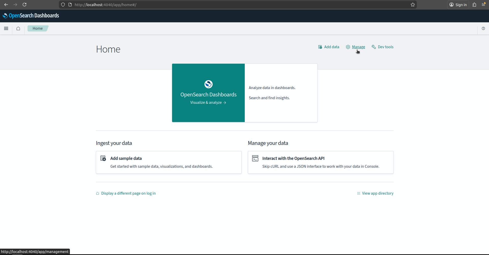
- Then access [OpenSearch Dashboards](http://localhost:4040).
- On this page, click on **Manage** to set up a new index (see the `_index` field in [img_04](#img_04)).

## img_06: Set up Index Patterns

- Click on **Index Patterns** to set up the index.

## img_06_1: View created indexes
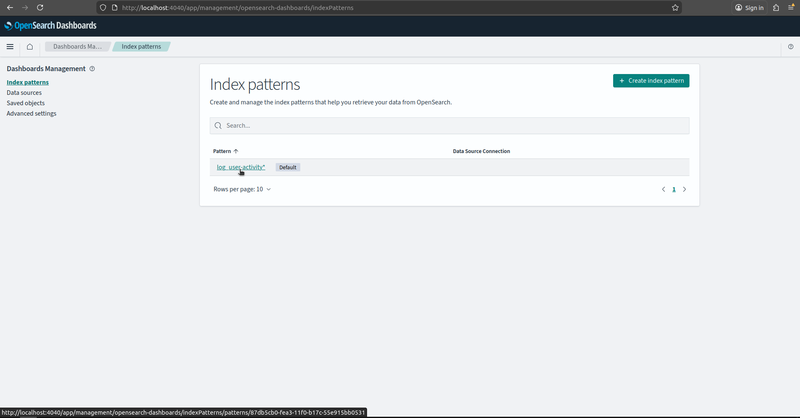
- After the step shown in [img_12](#img_12), you can access the **Index Patterns** menu again.
- This time, you will see the created indexes.
- You can click on any of them to review and manage their configuration.

## img_06_2: Refresh field list
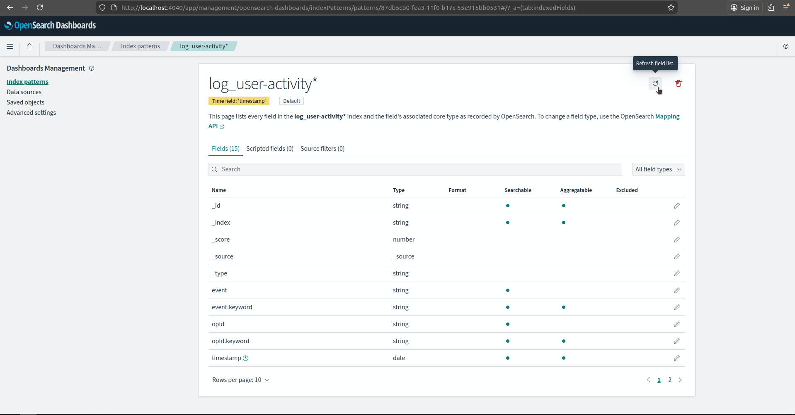
- When new fields are sent to this index, you need to click on **Refresh field list** to enable searches for the new field.

## img_07: Create Index Patterns
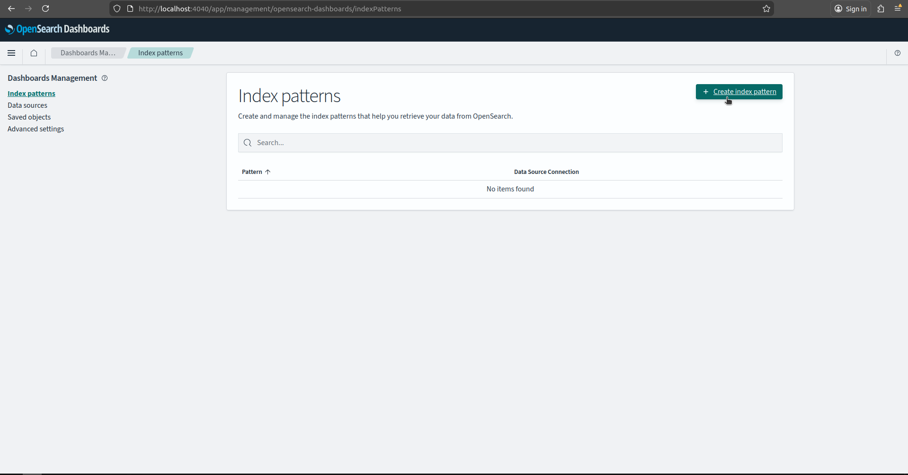
- Click on **Index Patterns** to create the index.

## img_08: Finding the index
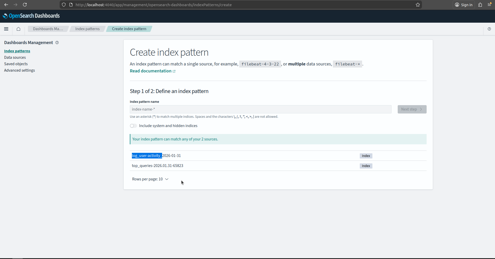
- Finding the index.

## img_09: Define index pattern
- Define the index pattern and click on **Next step**.
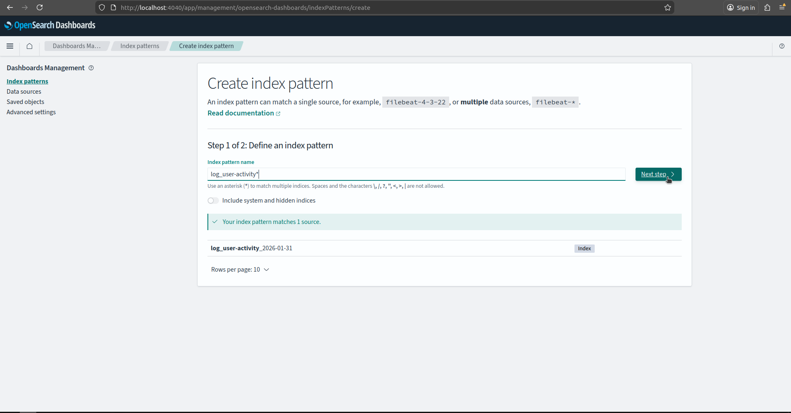

# img_10

- Select the 'timestamp' field from the index data.
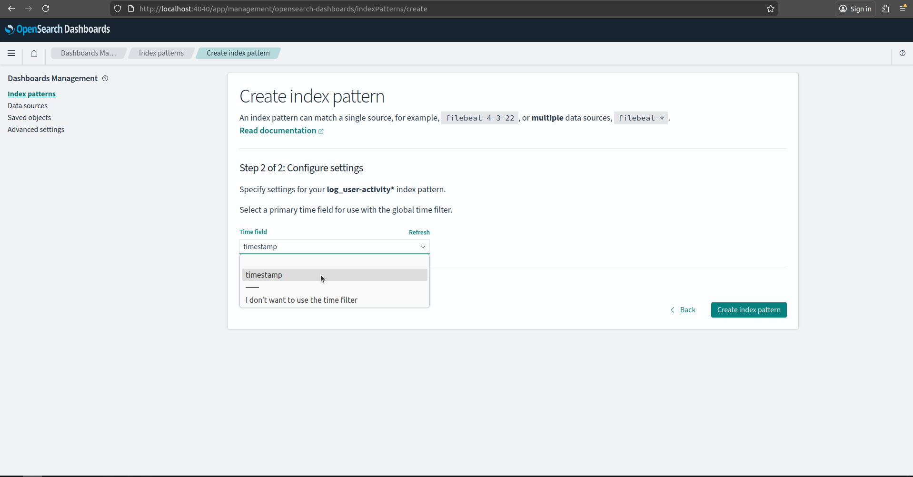

# img_11

- Click on 'Create index pattern'.
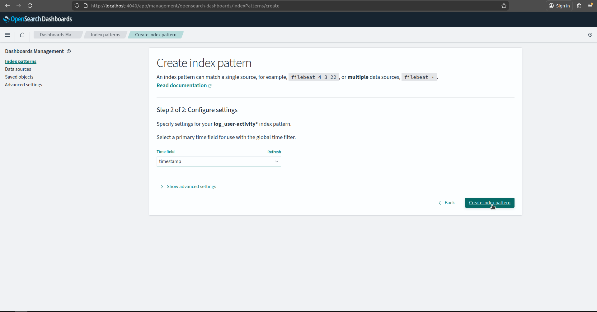

# img_12

- Shows the index data fields and its types.
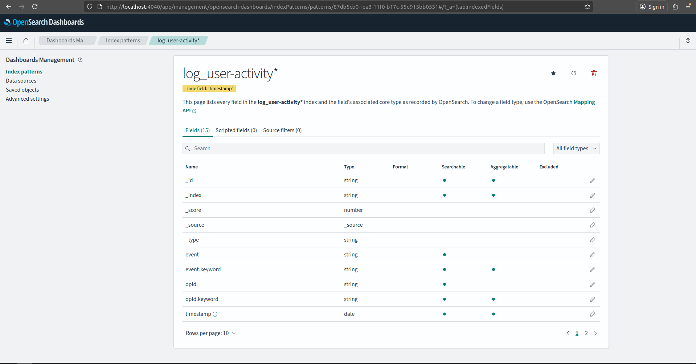

# img_13

- Click on the left 'menu' (the three lines icon), and on the 'Discover' menu item.
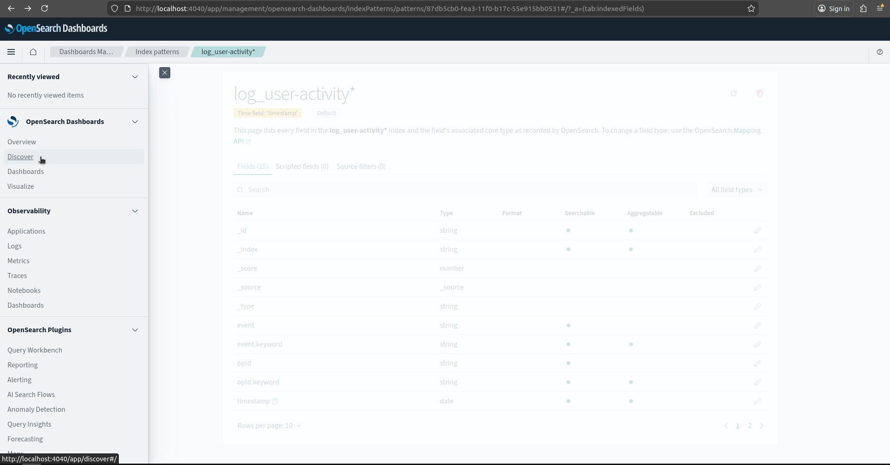

# img_14

- At the combo box (on the upper left), select the index pattern to view its data.
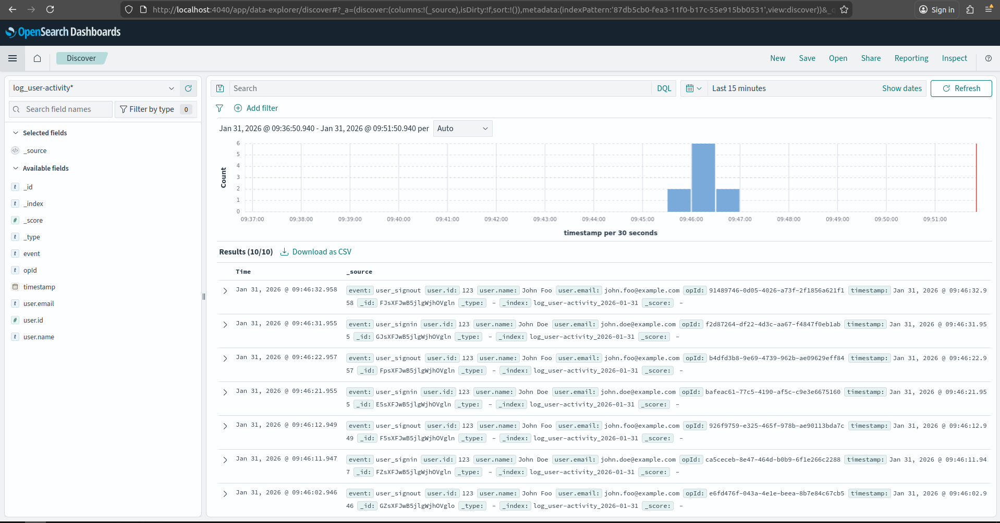

# img_15

- Then you can expand the data and do many other things.
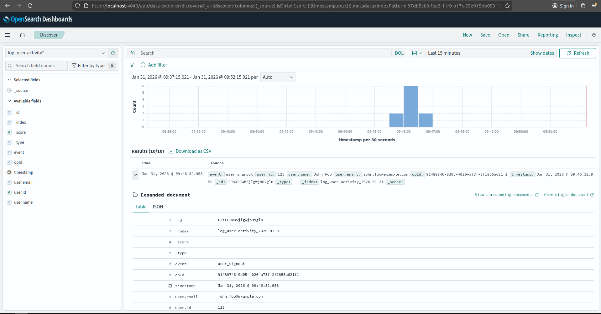

# img_16

- You can click on the left 'menu' and on 'Index Management' to manage index data.
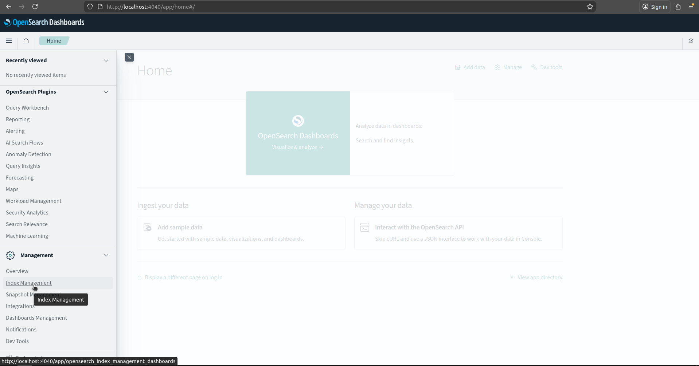

# img_16_1

- At the 'Index' menu you can see the indexes data.
- Note that each index has a trailing date to facilitate index management.
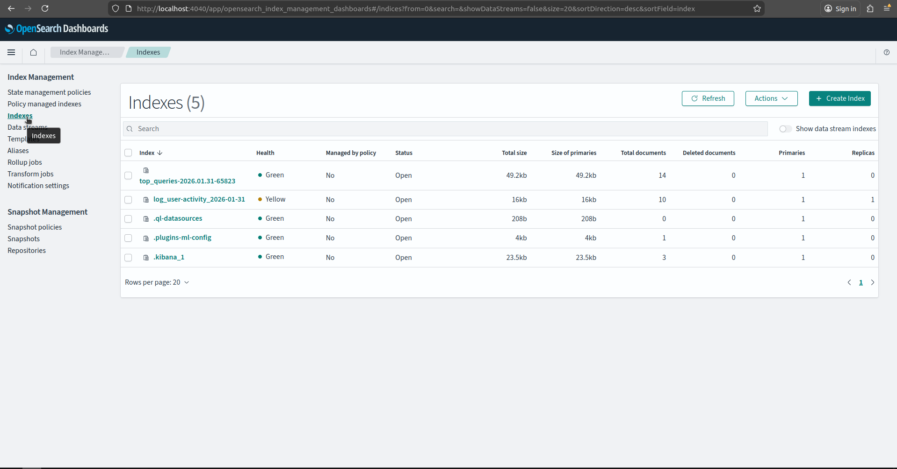

# img_16_2

- You can click on a specific index to manage its data.
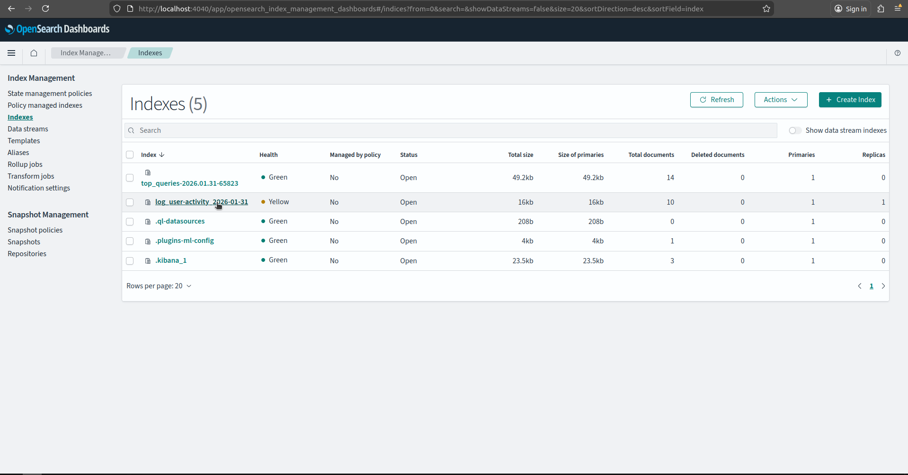